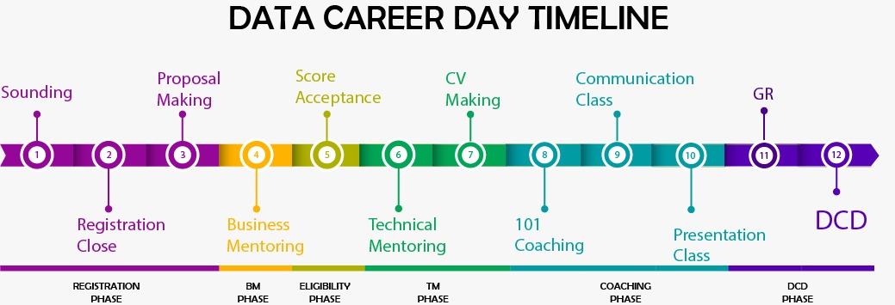

# Data Career Day (DCD)

## Alur Data Career Day

## Pre-Requisite Data Career Day

1. *Self-Funding* pada Academy Reguler/Academy Full Stack
2. Total score minimal 85%
3. Mengerjakan 5 dari 9 Learn by Building
4. Melakukan pendaftaran saat Registration Pace

### Registration

- Sebelum Registration

1. Hubungi Tata untuk mendapatkan list email student offline yang melakukan pembiayaan sendiri [link](https://docs.google.com/spreadsheets/d/1iZy0AaFASL7IY5BIGZmaOsIqkdX6LR6Mo2gpJZEG2KA/edit#gid=1637612767)
2. Hubungi Tata untuk mendapatkan list email student online yang melakukan pembiayaan sendiri
3. Siapkan timeline dari sosialisasi DCD - hari H
4. Siapkan slide sosialisasi DCD [link](https://docs.google.com/presentation/d/1acPcUvZG85oEJsLtOGJx3FINGa8Rrhv-CBt-tqAJG_M/edit#slide=id.p1)
5. Sipkan GForm registration (contoh [Gform](bit.ly/registdcd9))
6. Siapkan publication proposal example [link](bit.ly/publicationexample)
7. Mendapatkan list Business Mentor (BM) dan Technical Chaperone (TC) (hubungi **David**)

- Selama Registration
  
1. Menyiapkan draft email registrasi DCD [link](https://docs.google.com/document/d/1EDYH3DnzUElPApt2pIBEh9HJV5d7K0OmmsTOs5BmcKI/edit#heading=h.pwbvr5nj1ufg)
2. Mengirimkan email reminder penutupan regirtration DCD [link](https://docs.google.com/document/d/1EDYH3DnzUElPApt2pIBEh9HJV5d7K0OmmsTOs5BmcKI/edit#heading=h.yhbqjuew20hg)
3. Membuat Gsheet daftar calon peserta DCD (contoh [Gsheet](https://docs.google.com/spreadsheets/d/1P_dRfwtu_yTWtPr-RHKjIon_ZXVUdf2RtMXiWMqWrZk/edit#gid=2115785632))
4. Melakukan briefing mengenai timeline dan workflow DCD kepada mentor Team (mentoring workflow [link](https://docs.google.com/presentation/d/1ogfiBuV0qUP1h7Dm6Q8rn_u2lRbTU45XpBEG02RPx-k/edit#slide=id.p3))

- Setelah Registration
  
1.  Melakukan plotting student dengan BM berdasarkan case yang diambil oleh student [link](https://docs.google.com/spreadsheets/d/1P_dRfwtu_yTWtPr-RHKjIon_ZXVUdf2RtMXiWMqWrZk/edit#gid=1325523908)
2.  Mengirimkan email mentor assigning kepada calon peserta yang sudah mendaftar (draft email [mentor assigning](https://docs.google.com/document/d/1EDYH3DnzUElPApt2pIBEh9HJV5d7K0OmmsTOs5BmcKI/edit#heading=h.bwo0f6c325u7))
3. Invite student pada channel slack Algoritma Alumni sebagai platform komunikasi

### Business Mentor Phase

1. Membuat sheet weekly report mentor yang dapat ditransfer untuk mentor pada pace berikutnya [link](https://docs.google.com/spreadsheets/d/1kDS77uA1uYJJyS_Oatv_WJTKEOiYXZgkUyEF3CEXo-M/edit#gid=223180597)
2. Membuat rekapan nilai dan LBB student [link](https://docs.google.com/spreadsheets/d/1kDS77uA1uYJJyS_Oatv_WJTKEOiYXZgkUyEF3CEXo-M/edit#gid=2041422256)
3. Membuat list eligible student dari registration phase, BM phase, TC phase [link](https://docs.google.com/spreadsheets/d/1kDS77uA1uYJJyS_Oatv_WJTKEOiYXZgkUyEF3CEXo-M/edit#gid=43809870)
4. Melakukan  follow-up link proposal project student kepada BM dan diletakkan pada satu sheet report mentor
5. Plotting student dengan TC
6. Mengirimkan reminder pengumpulan terakhir proposal project dan beberapa persyaratan lain (draft email [link](https://docs.google.com/document/d/1EDYH3DnzUElPApt2pIBEh9HJV5d7K0OmmsTOs5BmcKI/edit#heading=h.eaf8e2km1m0z))
7. Mengirimkan email acceptance dan rejected peserta (draft email [acceptance BM](https://docs.google.com/document/d/1EDYH3DnzUElPApt2pIBEh9HJV5d7K0OmmsTOs5BmcKI/edit#heading=h.y18cmaj9rlr8) & [rejected BM](https://docs.google.com/document/d/1EDYH3DnzUElPApt2pIBEh9HJV5d7K0OmmsTOs5BmcKI/edit#heading=h.lwhoq5jstbkk))

### Technical Chaperone Phase

1. Monitoring dan follow-up weekly repost progress student kepada TC [link](https://docs.google.com/spreadsheets/d/1kDS77uA1uYJJyS_Oatv_WJTKEOiYXZgkUyEF3CEXo-M/edit#gid=223180597)
2. Mengirimkan email pendataan CV student online saat minggu pertama TC pace [link](bit.ly/student-cv-online)
3. [Optional]Request sesi foto ke Kak Mulia dan Ziqka untuk CV student (Hubungi Kak irvan ketersediaan baju graduate student)
4. Melakukan pendataan cv student saat minggu terakhir TC pace [link](bit.ly/student-cv-dcd9)
5. Melakukan rekapitulasi dan cross check [informasi CV student DCD](bit.ly/algo-student-dcd-cv) dan [informasi CV student online](bit.ly/algo-student-online-cv)
6. Pada akhir deadline pengumpulan dan pengisian CV (baik student DCD maupun student online), informasikan kepada Kak Mulia untuk proses pembuatan CV
7. Kerjasama marketing mengenai vanue DCD dan teknis hari H DCD

### Coaching Phase

1. Memastikan Veteran yang akan mengisi 101 dashboard, communication class, dan presentation class serta jadwal yang setiap sesi.
2. Memastikan setiap peserta hadir dalam setiap sesi.
3. Koordinasi dengan marketing untuk GR dan hari-H terkait kesiapan acara 

### The Day DCD

1. Memastikan student ready saat akan tampil
2. Memastikan jalannya acara berjalan dengan lancar dari presentasi student hingga speed dating
3. Evaluasi dengan seluruh tim 