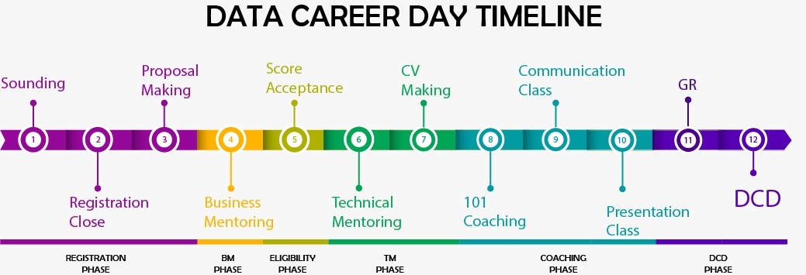

--- 
title: "Academy for Dummies"
author: "Team Algoritma"
date: "`r format(Sys.Date(), '%e %B, %Y)`"
site: bookdown::bookdown_site
documentclass: book
bibliography: [book.bib, packages.bib]
biblio-style: apalike
link-citations: yes
description: "Academy for Dummies digunakan sebagai panduan setiap tim yang bertugas pada Algoritma Academy."
---

# Introduction

Academy for Dummies (A4D) ditulis oleh tim Algoritma untuk panduan seluruh tim yang bertugas dan berhubungan dengan kegiatan dalam Algoritma Academy.

**Algoritma** merupakan pelatihan *data science* yang berdomisili di Jakarta. Kami menyelenggarakan *workshop* dan program pelatihan untuk membantu para pekerja profesional dan siswa dalam menguasai berbagai sub bidang data, meliputi: visualisasi data, *machine learning*, *data modeling*, statistika, dan lain sebagainya.

```{r include=FALSE}
# automatically create a bib database for R packages
knitr::write_bib(c(
  .packages(), 'bookdown', 'knitr', 'rmarkdown'
), 'packages.bib')
knitr::opts_chunk$set(echo = TRUE,
                      fig.align = "center",
                      fig.width = "100%")
```

<!--chapter:end:index.Rmd-->

# Fasilitas Student

Setiap student memiliki beberapa administrasi yang perlu diketahui dan diikuti selama mengikuti kelas Algoritma Academy.

## Pengajuan Mentoring

Mentoring merupakan salah satu fasilitas yang diterima oleh student Algoritma berupa sesi 101 dengan mentor Algoritma untuk menanyakan hal-hal yang belum dipahami dan ingin dipelajari lebih lanjut. Berikut ini beberapa peraturan yang berhubungan dengan mentoring:

1. Mentoring dilaksanakan **1x/minggu** dengan durasi 1 jam pada hari kerja Senin-Jumat pukul 10:00-18:00.
2. Pengajuan mentoring terpusat melalui email [mentor@algorit.ma](mentor@algorit.ma).
3. Permintaan mentoring dilakukan **maksimal H-1 sebelum hari mentoring** yang diinginkan pada hari Senin-Jumat pukul 10:00-18:00 WIB, dengan template permintaan mentoring sebagai berikut:

```
Berikan subject email : ALGORITMA MENTORING SESSION
Nama : ___________
Kelas : ___________ (nama batch day / night)
Materi mentoring : ___________
Tanggal, Jam mentoring : ___________
```
4. Permintaan mentoring yang diajukan melewati jam kerja akan dibalas pada hari berikutnya dan pelaksanaan mentoring tidak dapat dilakukan pada hari yang sama.
5. Pengajuan mentoring yang tidak sesuai dengan template yang ada maka akan dikembalikan kepada student kembali hingga informasi pada template mentoring sudah terpenuhi. Apabila informasi pada template telah terpenuhi, mentoring baru akan diproses.
6. Apabila terdapat lebih dari satu permintaan mentoring dengan waktu serta materi yang sama, maka admin dapat menawarkan untuk dilakukan secara bersamaan dengan mentor yang sama.
7. Student tidak diperkenankan untuk memilih mentor untuk membantunya selama mentoring.

## Pengajuan Pertanyaan

1. Setiap student yang mengalami kesulitan dalam proses belajar memiliki hak untuk bertanya diluar kelas baik secara langsung maupun melalui email.
2. Pengajuan pertanyaan diluar kelas melalui email terpusat melalui email [mentor@algorit.ma](mentor@algorit.ma).
3. Tidak diperkenankan bagi tim Sales memberikan nomor handphone kepada student.
4. Pengajuan pertanyaan yang baik dan benar sesuai dengan dokumentasi berikut : [How to ask question](https://drive.google.com/file/d/1gWSTNF3wXK5Lbfssb-eT_A3gbnLvY_ez/view?usp=sharing)[^1]

## Pengajuan Pindah Kelas

Student yang memiliki kendala dalam mengikuti kelas sesuai jadwal yang telah diikuti dapat mengajukan pindah kelas. Adapun syarat pengajuan pindah kelas adalah sebagai berikut:

1. Student melakukan pengajuan pindah kelas **maksimal H-2 (pada hari kerja)** sebelum jadwal perpindahan kelas yang diajukan melalui email [mentor@algorit.ma](mentor@algorit.ma).
2. Pengajuan pindah kelas hanya bisa dilakukan **1 *course* penuh**.
3. Setelah pengajuan pindah kelas disetujui, teaching assistant yang bertugas pada course tersebut **wajib** memberikan undangan kepada student untuk masuk ke dalam google classroom kelas yang akan diikuti.
4. Student yang telah bergabung pada google classroom yang baru berhak untuk:

* mendapatkan material utama dan inclass material selama *course* tersebut
* mendapatkan link kelas dan recording kelas (apabila student tersebut mengikuti kelas online)
* mendapatkan soal latihan atau pekerjaan rumah (PR) yang harus dikerjakan selama *course* berlangsung
5. Student yang melakukan perpindahakan kelas tetap **memgumpulkan quiz dan learn by building (LBB) pada google classroom mandatory (utama)** bukan pada google classroom selama perpindahan kelas.
6. Apabila *course* yang dilakukan pindah kelas telah selesai, maka teaching assistant wajib menghapus student tersebut dari google classroom sementaranya H+7 (termasuk hari libur) setelah *course* berakhir.

## Sertifikat

### Jenis Sertifikat

1. Sertifikat diberikan kepada student yang mengikuti kelas Algoritma Academy baik dalam bentuk kelas per spesialisasi, Academy Reguler, maupun Academy Full Stack baik secara offline maupun online.
2. Sertifikat yang diberikan terdapat tiga jenis sertifikat:

* [sertifikat per course](https://drive.google.com/file/d/1r_nST2hqB02afh3cMV1EypkxDvGab6WV/view?usp=sharing)
* [sertifikat specialization](https://drive.google.com/file/d/1m9CuUjAnWCspSyKGSmvmPc7eabCg_KWS/view?usp=sharing)
* [rubrik dari seluruh course](https://drive.google.com/file/d/11joZCgOGWZqxQTAjVaOMNy9ct1U4h5-P/view?usp=sharing)


### Pemberian Sertifikat

1. Sertifikat per course akan dikirimkan **setiap hari Jumat** setelah course berakhir yang dapat diakses melalui google classroom.
2. Sertifikat specialization serta rubrik dalam bentuk *softcopy* akan diberikan dalam waktu **2 minggu setelah deadline pengumpulan capstone** pada masing-masing spesialisasi yang diambil melalui email.
3. Student yang diperbolehkan meminta sertifikat specialization dan rubriks dalam bentuk *hardcopy* hanya yang mengikuti kelas secara offline.  
4. Student yang menginginkan sertifikat specialization dalam bentuk *hardcopy* dapat mengajukan melalui link GForm berikut [http://bit.ly/request-certificate](http://bit.ly/request-certificate) yang akan disampaikan melalui classroom.

## Letter of Recommendation (LoR)

*Letter of recommendation* merupakan surat rekomendasi yang diberikan oleh pihak Algoritma kepada student yang memiliki  nilai minimal 90% yang dapat digunakan surat pendamping dalam melamar pekerjaan. Berikut syarat student yang dapat mendapatkan LoR:

1. Student yang mengikuti kelas  Academy Full Stack atau Academy Reguler secara offline. 
2. Memiliki nilai minimal 90% dari total nilai spesialisasi.
3. Untuk mendapatkan LoR, student harus mengajukan pembuatan LoR melalui email [mentor@algorit.ma](mentor@algorit.ma) dengan memberikan informasi:

* Nama
* Nomor Induk Kependudukan (NIK)
* Alamat sesuai KTP

## Fasilitas Setelah Kelas

Algoritma menyediakan *lifetime learning* yang bisa dimanfaatkan oleh student setelah menyelesaikan Algoritma Academy. Fasilitas yang diberikan kepada student dibedakan berdasarkan jenis kelas yang diambil yaitu secara offline atau online.

### Academy Offline Full Stack / Reguler

1. Mendapatkan fasilitas mentoring selama 4 minggu setelah Capstone Project Machine Learning.
2. Diundang pada forum diskusi alumni Algoritma menggunakan platform Slack. 
3. Mendapatkan fasilitas career support berupa project show case dalam event Data Career Day (DCD) dan pembuatan curriculum vitae (CV) yang akan dikirimkan kepada *hiring partner* Algoritma.
4. Gratis mengikuti beberapa workshop yang diselenggarakan oleh Algoritma tanpa batasan waktu dengan limit biaya workshop sebesar 35 juta.

### Academy Online Full Stack / Reguler

1. Mendapatkan fasilitas mentoring selama 4 minggu setelah Capstone Project Machine Learning.
2. Diundang pada forum diskusi alumni Algoritma menggunakan platform Slack. 
3. Mendapatkan fasilitas career support berupa pembuatan curriculum vitae (CV) yang akan dikirimkan kepada *hiring partner* Algoritma.


<!--chapter:end:01-fasilitas-student.Rmd-->

# Academy for Dummies

Berikut beberapa hal yang perlu dipersiapkan selama bertugas di kelas Algoritma Academy `r emo::ji("smile")`.

## Persiapan Academy

### Sebelum Kelas

#### Kelas Offline

* **TA** mengirimkan postingan yang berisi informasi kelas sesuai dengan template [berikut](https://docs.google.com/document/d/1leWbp3Eb2AwumFieuHiWStSNOXsKJQJD_h0tAhA2fLs/edit?usp=sharing) H-1 pada hari kerja sebelum kelas dimulai pada google classroom.
* **TA** mengirimkan course material H-1 pada hari kerja sebelum kelas dimulai pada google classroom. Link drive material dapat diakses pada [link berikut](https://drive.google.com/drive/folders/1I1h0p4BkvkUYV8mtDU7bgswE_awOIxWY?usp=sharing).
* **TA** mengirimkan informasi mengenai kelas hanya pada student yang terdapat pada kelas tersebut sesuai dengan informasi pada sheet [active student](https://docs.google.com/spreadsheets/d/12FB9410fhRhZp9jl5qLe7x-LGw0QTSfLujA-dE867JE/edit?usp=sharing).
* **Instructor** melakukan *briefing* dengan *teaching team* yang bertugas.

#### Kelas Online

* **TA** mempersiapkan link zoom meeting, [Online Class Guide](https://docs.google.com/document/d/16algZSEqLos2fksPcbmpUrpvvuVr62msVY13M8uPNos/edit?usp=sharing), [Error Issues](https://docs.google.com/document/d/1ZkhuxSTBjUqzbHeLsRbk8E4L1FFymWH0UmaI3xaomkg/edit?usp=sharing), dan link absensi H-1 pada hari kerja sebelum kelas dimulai 
* **TA** mengirimkan postingan yang berisi informasi kelas sesuai dengan template [berikut](https://docs.google.com/document/d/1leWbp3Eb2AwumFieuHiWStSNOXsKJQJD_h0tAhA2fLs/edit?usp=sharing) H-1 pada hari kerja sebelum kelas dimulai pada google classroom.
* **TA** mengirimkan course material H-1 pada hari kerja sebelum kelas dimulai pada google classroom. Link drive material dapat diakses pada [link berikut](https://drive.google.com/drive/folders/1I1h0p4BkvkUYV8mtDU7bgswE_awOIxWY?usp=sharing)
* **TA** mengirimkan informasi mengenai kelas hanya pada student yang terdapat pada kelas tersebut sesuai dengan informasi pada sheet [active student](https://docs.google.com/spreadsheets/d/12FB9410fhRhZp9jl5qLe7x-LGw0QTSfLujA-dE867JE/edit?usp=sharing)
* **Instructor** melakukan *briefing* dengan *teaching team* yang bertugas.

> Bagi yang bertugas online dan merasa membutuhkan kamera, mic, dan wacom dapat menghubungi operation. Selain itu yang merasa koneksi internet tidak stabil, dapat datang ke kantor agar kelas berjalan dengan baik.

### Saat Kelas

#### Kelas Offline

* **TA** melakukan pengecekan papan tulis, spidol, dan *projector* dapat berjalan dengan baik.
* **TA** mengadakan sesi QnA selama 30 menit sebelum kelas.
* **TA** memastikan setiap student melakukan pengisian absensi.
* **TA** memberikan sticky notes atau mengirimkan pesan melalui Slack/Zoom ketika ingin memberitahukan sesuatu kepada instructor.
* **TA** menjadi time keeper bagi instructor yang bertugas.
* Hari terakhir kelas, **TA** mengirimkan *assignment* quiz dan LBB pada google classroom.
* Hari terakhir kelas, *teaching team* memberikan link feedback kepada student. 

#### Kelas Online

* Melakukan pengecekan koneksi internet, kamera, dan audio dapat berjalan dengan baik. 
* **TA** mengadakan sesi QnA selama 30 menit sebelum kelas.
* **TA** memastikan recording dimulai sejak sesi QnA 30 menit sebelum kelas hingga kelas berakhir.
* **TA** mengirimkan link absensi kepada student.
* Apabila student mengalami eror, maka TA mengarahkan student untuk mengirikan *screenshot* eror pada GDocs *Error Issues* yang sudah dipersiapkan.
* Setiap diadakan dive deeper, maka *teaching team* diperkenankan mengarahkan student untuk mengirimkan hasil pengerjaan dive deepernya pada GDocs yang sudah disediakan.
* Mengirimkan pesan melalui Slack/Zoom ketika ingin memberitahukan sesuatu kepada instructor.
* **TA** diperkenankan untuk membantu menjawab pertanyaan dari student yang dirasa bersifat umum.
* **TA** menjadi time keeper bagi instructor yang bertugas.
* Hari terakhir kelas, **TA** mengirimkan *assignment* quiz dan LBB pada google classroom.
* Hari terakhir kelas, *teaching team* memberikan link feedback kepada student. 

### Setelah Kelas

#### Kelas Offline

* Membersihkan papan tulis dan area kelas.
* Mematikan AC dan lampu serta memastikan pintu telah dikunci.
* **Instructor** mengirimkan inclass yang telah digunakan **langsung** setelah kelas berakhir pada google classroom.
* **TA** memasukkan nilai quiz pada google classroom dan [*score sheets*](https://docs.google.com/spreadsheets/d/1cGJ0pn9k9gKCBnceWVwaL9D7BBDMNjLh8uPYlaBlJi8/edit?usp=sharing) **maksimal H+1 setelah deadline pengumpulan quiz**.
* Teaching team saling memberikan feedback dan input untuk perbaikan kelas.

#### Kelas Online

* **TA** mengirimkan recording kelas dengan maksimal batas waktu sebagai berikut:

  + Kelas Day: pukul 19:00 hari yang sama dengan workshop
  + Kelas Night: pukul 14:00 WIB H+1 workshop

* **Instructor** mengirimkan inclass yang terlah digunakan **langsung** setelah kelas berakhir pada google classroom.
* **TA wajib** memasukkan nilai quiz pada google classroom dan [*score sheets*](https://docs.google.com/spreadsheets/d/1cGJ0pn9k9gKCBnceWVwaL9D7BBDMNjLh8uPYlaBlJi8/edit?usp=sharing) **maksimal H+1 setelah deadline pengumpulan quiz**.
* Teaching team saling memberikan feedback dan input untuk perbaikan kelas.

> Dokumentasi fungsi untuk input nilai quiz dapat diakses menggunakan [package AlgortimaAcademy](https://github.com/Davidlimbong/AlgoritmaAcademy)

## Quiz Guidelines
### Rubrik dan Link Quiz

* Setiap quiz memiliki **penilaian biner**, 0 dan nilai penuh.
* Student yang tidak memenuhi batas minimal quiz akan diberikan nilai **0**.
* Student yang memenuhi batas minimal quiz akan diberikan **nilai penuh.**

Berikut ini link quiz pada [corgi.re](corgi.re):

**Data Analytics Specialization**

* [Python for Data Analytics (P4DA)](https://corgi.re/courses/ttnsy/quiz_PYW1) maksimal **nilai 6**
* [Exploratory Data Analysis (EDA)](https://corgi.re/courses/ttnsy/quiz_PYW2) maksimal **nilai 6**
* [Data Wrangling & Visualization (DWV)](https://corgi.re/courses/ttnsy/quiz_PYW3) maksimal **nilai 6**
* [SQL Query](https://corgi.re/courses/ttnsy/quiz_PYW4) maksimal **nilai 6**

**Data Visualization Specialization**

* [Programming for Data Science - Practical Statistics (P4DS-PS)](https://corgi.re/courses/Davidlimbong/P4DS-PS)  maksimal **nilai 4**
* [Data Visualization (DV)](https://corgi.re/courses/Argaadya/Data-visualization) maksimal **nilai 2**
* [Interactive Plotting (IP)](https://corgi.re/courses/Davidlimbong/InteractivePlotting) maksimal **nilai 1**

**Machine Learning Specialization**

* [Programming for Data Science - Practical Statistics (P4DS-PS)](https://corgi.re/courses/Davidlimbong/P4DS-PS) maksimal **nilai 4**
* [Regression Model (RM)](https://corgi.re/courses/ahmadhusain/regressionmodels) maksimal **nilai 4**
* [Classification in Machine Learning I (C1)](https://corgi.re/courses/inytss/classification1) maksimal **nilai 4**
* [Classification in Machine Learning II (C2)](https://corgi.re/courses/ysitta/classification2) maksimal **nilai 4**
* [Unsupervised Learning (UL)](https://corgi.re/courses/Davidlimbong/UnsupervisedLearning) maksimal **nilai 4**
* [Time Series and Forecasting (TS)](https://corgi.re/courses/inytss/time-series) maksimal **nilai 4**
* [Neural Network (NN)](https://corgi.re/courses/ysitta/neural_Network) maksimal **nilai 4**

### Aturan Quiz

* *Assignment* quiz dikirimkan pada hari terakhir course melalui google classroom.
* Quiz dilakukan pada hari terakhir setiap course yang dilakukan secara serentak.
* Maksimal pengumpulan quiz setiap kelas sebagai berikut:

  + Kelas Day: pukul 19:00 WIB pada hari yang sama quiz diadakan
  + Kelas Night: pukul 09:00 WIB H+1 quiz diadakan

* Student tidak diperkenankan untuk mengerjakan quiz diluar waktu yang ditentukan.

### Quiz Susulan dan Perbaikan

* Bagi student yang mengikuti kelas **Data Analytics Specialization** dapat melakukan perbaikan / susulan quiz dengan **maksimal 2 course** yang dapat dilakukan perbaikan / susulan.
* Bagi student yang mengikuti kelas **Data Visualization dan Machine Learning Specialization** dapat melakukan perbaikan / susulan quiz dengan **maksimal 3 course** yang dapat dilakukan perbaikan / susulan dari total course yang ada baik dalam Data Visualization Specialization maupun Machine Learning Specialization.
* Student yang bisa mengikuti quiz susulan adalah student yang berhalangan hadir saat quiz dilaksanakan dikelas.
* Student yang bisa mengikuti perbaikan quiz adalah student yang tidak memenuhi nilai minimal quiz.
* Soal untuk quiz susulan dan perbaikan sama seperti quiz pada umumnya.
* Pelaksanaan quiz susulan dilakukan 3 hari setelah *briefing* Capstone Project dari setiap spesialisasi pada pukul 18.30 - 20:30 WIB.
* Nilai quiz akan diperbaharui melalui google classroom dan [sheet score](https://docs.google.com/spreadsheets/d/1cGJ0pn9k9gKCBnceWVwaL9D7BBDMNjLh8uPYlaBlJi8/edit?usp=sharing) oleh PIC academy.

## Learn by Building (LBB) Guidelines
### Rubrik LBB

Detail rubrik masing-masing LBB pada **Data Visualization Specialization** dan **Machine Learning Specialization** dapat dilihat pada link [berikut](https://rpubs.com/AlgoritmaAcademy/lbb)

### Aturan LBB

* Rubrik LBB dikirimkan pada hari terakhir course bersamaan pengiriman *assignment* quiz.
* Student yang mengumpulkan LBB wajib menyertakan link publish LBB pada RPubs, Github, atau platform lainnya.
* Deadline pengumpulan LBB bagi student yang ingin mengikuti *career support* Algoritma dibagi menjadi 3 fase dengan detail sebagai berikut:

  + Fase 1: LBB P4DS, DV, dan IP maksimal dikumpulkan sebelum Capstone Project Data Visualization.
  + Fase 2: LBB RM, C1, dan C2 maksimal dikumpulkan sebelum course TS dimulai.
  + Fase 3: LBB UL, TS, dan NN maksimal dikumpulkan 1 minggu setelah deadline Casptone Project Machine Learning.

* Student yang terlambat mengumpulkan LBB tidak mendapat pengurangan nilai kecuali LBB IP, keterlambatan akan dikenakan **pengurangan nilai 1 poin**.
* Student yang mengumpulkan LBB akan diberikan feedback oleh tim mentor **maksimal 3 hari** setelah LBB dikumpulkan melalui google classroom.
* Bagi student yang ingin mendapatkan career support **wajib** mengumpulkan LBB dengan detail banyaknya LBB yang harus dikumpulkan dapat dilihat pada **Chapter Data Career Day (DCD)**.

## Casptone Guidelines

### Rubrik Capstone

* Detail rubtik Capstone Project DA dapat diakses pada:

  + [Auto Generated Email Based Report](https://github.com/ttnsy/fire-capstone)
  + [Named Entity Recognition Service (API)](https://github.com/iqbalbasyar/ner-flask)
  + [Flask Dashboard User Interface (UI)](https://github.com/fafilia/capstone-UIFlask)
  + [Web Scraping using `BeautifulSoup`](https://github.com/t3981-h/BeautifulSoup-Capstone)
  
* Detail rubrik Capstone Project DV dapat diakses pada [link berikut](https://rpubs.com/AlgoritmaAcademy/dv-capstone).
* Detail rubrik Capstone Project ML dapat diakses pada [link berikut](https://rpubs.com/AlgoritmaAcademy/ml-capstone)

### Link Referensi Capstone

Berikut beberapa link referensi yang diperlukan saat Capstone Project:

* **Capstone Data Analytics**

  + [Postingan Classroom](https://docs.google.com/document/d/1leWbp3Eb2AwumFieuHiWStSNOXsKJQJD_h0tAhA2fLs/edit#heading=h.sdnb3cqdb3)
  + [Video Guideline](http://bit.ly/capstone-da-video)
  + [Capstone Data Analytics Guide](http://bit.ly/template-capstone-da-guide)

  
* **Capstone Data Visualization**

  + [Postingan Classroom](https://docs.google.com/document/d/1leWbp3Eb2AwumFieuHiWStSNOXsKJQJD_h0tAhA2fLs/edit#heading=h.jioetifqgq8a)
  
* **Capstone Machine Learning**

  + [Postingan Classroom](https://docs.google.com/document/d/1leWbp3Eb2AwumFieuHiWStSNOXsKJQJD_h0tAhA2fLs/edit#heading=h.kum7jj8wqp5o)
  + [Video Guideline](http://bit.ly/capstone-ml-video)
  + [Dataset untuk Machine Learning Capstone Project](https://bit.ly/captone-ml-dataset)
  + [Machine Learning Capstone Project Leaderboard](https://algoritma.shinyapps.io/leaderboard_capsml/)
  + [AlgoTech](https://algotech.netlify.com/tags/capstone-ml/)
  
### Aturan Capstone

* Rubrik capstone akan dijelaskan secara serentak saat di kelas.
* Selama di kelas, student akan diberikan capaian task yang harus dikerjakan dan dikumpulkan pada google classroom pada hari yang sama saat briefing capstone project.
* Deadline pengerjaan capstone sebagai berikut:

  + Capstone DA: 2 hari setelah pertemuan mentoring capstone, yaitu hari Senin.
  + Capstone DV dan ML: 1 minggu setelah briefing capstone.

* Keterlambatan dalam pengumpulan capstone akan mendapatkan pinalti sebagai berikut:

    + Terlambat 1 hari: pengurangan 1 poin
    + Terlambat 2 hari: pengurangan 3 poin
    + Terlambat 3 hari: pengurangan 5 poin
    + Terlambat 4 hari: pengurangan 7 poin
    + Terlambat lebih dari 4 hari: pengurangan 9 poin
    + Terlambat lebih dari 1 bulan tidak akan mendapatkan nilai capstone

> Notes: Pinalti diatas dihitung berdasarkan hari kerja

* Product team akan melakukan koreksi dan memberikan feedback **maksimal 2 hari** setelah student mengumpulkan capstone.
* Student dapat memperbaiki capstone sebanyak **1 kali** dengan batas pengumpulan **1 minggu** setelah batas pengumpulan capstone.
* Product team yang melakukan koreksi dan memberikan feedback **wajib langsung memasukkan nilai] capstone pada [sheet score](https://docs.google.com/spreadsheets/d/1cGJ0pn9k9gKCBnceWVwaL9D7BBDMNjLh8uPYlaBlJi8/edit?usp=sharing).
* Student yang dapat melakukan perbaikan harus memiliki nilai:
  
  + Capstone DA: dibawah 12 poin
  + Capstone DV: dibawah 23 poin
  + Capstone ML: dibawah 28 poin
  
* Nilai maksimal yang bisa didapatkan oleh student yang melakukan revisi adalah 80% dari total nilai. 
* Pengumpulan revisi yang melebihi batas waktu (H+7 setelah batas pengumpulan capstone) **tetap akan diperiksa** namun nilai yang diambil adalah **nilai sebelum perbaikan**.
* Setiap Capstone Project akan diberikan satu sesi untuk mentoring secara serentak melalui RSVP yang dikirimkan melalui google classroom.
* **Student tidak diperkenankan** untuk meminta sesi mentoring melalui email [mentor@algorit.ma](mentor@algorit.ma).

<!--chapter:end:02-academy-for-dummies.Rmd-->

# Do's dan Don't

Setiap teaching team yang akan bertugas secara offline maupun online diharap mempelajari [*product internal brief*](https://docs.google.com/presentation/d/17f0z3x9RhJCjarY1yY3vWyW23kr-gSHHhTNdtd97BnM/edit?usp=sharing) berikut.

## Instructor

### Kelas Offline

**I. Do's**

* Datang tepat waktu.
* Mempersiapkan inclass material yang akan digunakan selama dikelas.
* Berpenampilan rapi dan sopan.
* Membuat timeline kelas.
* Merapikan inclass material yang diperbaharui per hari untuk dikirimkan kepada student melalui google classroom.
* Memberikan briefing kelas kepada teaching assistant.
* Mempersiapkan materi dan latihan.

**II. Don't**

* Tidak memberikan timeline kepada teaching assistant.
* Tidak melakukan briefing sebelum kelas dimulai.

### Kelas Online

**I. Do's**

* Datang tepat waktu pada room meeting.
* Memastikan koneksi internet, kamera, dan tools yang diperlukan sudah tersedia dengan baik.
* Mempersiapkan inclass material yang akan digunakan selama dikelas.
* Berpenampilan rapi dan sopan.
* Membuat timeline kelas.
* Merapikan inclass material yang diperbaharui per hari untuk dikirimkan kepada student melalui google classroom.
* Memberikan briefing kelas kepada teaching assistant.
* Mempersiapkan materi dan latihan.

**II. Don't**

* Mengadakan kelas di lokasi yang susah sinyal internet dan banyak noise.

## Teaching Assistant (TA)

### Kelas Offline

**I. Do's**

* Datang tepat waktu.
* Membawa flashdisk untuk menyimpan course material dan file instalasi R, RStudio, maupun Anaconda Navigator.
* Mempersiapkan kertas untuk time keeper dan meminta timeline kepada instructor.
* Membersihkan papan tulis sebelum dan sesudah kelas.
* Memastikan spidol dapat digunakan.
* Memastikan projector dengan laptop instructor dapat dihubungkan dengan baik.
* Memastikan absensi student telah tersedia dan memastikan setiap student telah mengisi absensi.
* Berpenampilan rapi dan sopan.
* Memimpin sesi 30 menit sebelum kelas dimulai untuk tanya jawab.
* Meminta link feedback dan memastikan link tersebut dapat digunakan dengan baik.
* Melakukan pengecekan ulang setiap draft postingan google classroom yang akan dikirimkan kepada student.
* Mengirimkan *assignment* quiz dan LBB pada google classroom.
* Mengirimkan inclass material yang telah diperbaharui oleh instructor per harinya dan lecture notes (jika ada).
* Memasukkan nilai quiz pada google classroom dan [*score sheets*](https://docs.google.com/spreadsheets/d/1cGJ0pn9k9gKCBnceWVwaL9D7BBDMNjLh8uPYlaBlJi8/edit#gid=1518964141).
* Memastikan ruang kelas bersih dan mematikan lampu serta AC ketika kelas telah selesai (untuk yang bertugas di kelas malam).
* Jangan ragu untuk meminta bantuan atau membantu satu sama lain saat bertugas.

**II. Don't**

* Mengenakan kaos dan kain flanel.
* Berbincang dengan suara yang keras saat dikelas.
* Mengenakan sandal.
* Mengacuhkan student yang sedang bertanya dikelas.


### Kelas Online

**I. Do's**

* Mempersiapkan link zoom kelas.
* Memastikan link absensi dapat digunakan dengan baik.
* Memastikan koneksi internet, kamera, dan audio instructor dan teaching team dapat berjalan dengan baik.
* Meminta timeline kepada instructor.
* Membuka room meeting tepat waktu.
* Memimpin sesi 30 menit sebelum kelas dimulai untuk tanya jawab.
* Berpenampilan rapi dan sopan.
* Membantu student yang bertanya melalui chat zoom everyone maupun *private message*.
* Menjaga timeline instructor agar sesuai yang direncanakan.
* Memberikan *summary* singkat yang disampaikan mengenai materi yang disampaikan di kelas dan pengumuman mengenai kelas melalui fitur *chat*.
* Memastikan meeting telah di record sejak sesi 30 menit sebelum kelas.
* Meminta link feedback dan memastikan link tersebut dapat digunakan dengan baik.
* Melakukan pengecekan ulang setiap draft postingan google classroom yang akan dikirimkan kepada student.
* Mengirimkan *assignment* quiz dan LBB pada google classroom.
* Mengirimkan inclass material yang telah diperbaharui oleh instructor per harinya dan lecture notes (jika ada).
* Memasukkan nilai quiz pada google classroom dan [*score sheets*](https://docs.google.com/spreadsheets/d/1cGJ0pn9k9gKCBnceWVwaL9D7BBDMNjLh8uPYlaBlJi8/edit#gid=1518964141).
* Mengirimkan link recording melalui google classroom.

**II. Don't**

* Menghidupkan mic ketika instructor sudah memulai kelas agar tidak terdapat noise.
* Mengacuhkan student yang bertanya melalui *private message* walaupun student tersebut bukan dibawah tanggung jawab Anda.
* Terlambat mengirimkan link recording.

<!--chapter:end:03-do-dont.Rmd-->

# Data Career Day (DCD)

## Alur Data Career Day



## Pre-Requisite Data Career Day

1. *Self-Funding* pada Academy Reguler/Academy Full Stack/Beasiswa Full Stack
2. Total score minimal 85%
3. Mengerjakan 5 dari 9 Learn by Building (LBB) (sudah termasuk LBB IP)
4. Melakukan pendaftaran saat Registration Pace
5. Mengumpulkan proposal project yang akan dikerjakan dalam bentuk link rpubs

### Registration


- Sebelum Registration

1. Hubungi Tata untuk mendapatkan list email student offline yang melakukan pembiayaan sendiri [link](https://docs.google.com/spreadsheets/d/1iZy0AaFASL7IY5BIGZmaOsIqkdX6LR6Mo2gpJZEG2KA/edit#gid=1637612767)
2. Hubungi Tata untuk mendapatkan list email student online yang melakukan pembiayaan sendiri
3. Siapkan timeline dari sosialisasi DCD - hari H
4. Siapkan slide sosialisasi DCD [link](https://docs.google.com/presentation/d/1acPcUvZG85oEJsLtOGJx3FINGa8Rrhv-CBt-tqAJG_M/edit#slide=id.p1)
5. Sipkan GForm registration (contoh [Gform](bit.ly/registdcd9))
6. Siapkan publication proposal example [link](bit.ly/publicationexample)
7. Mendapatkan list Business Mentor (BM) dan Technical Chaperone (TC) (hubungi **David**)

- Selama Registration
  
1. Menyiapkan draft email registrasi DCD [link](https://docs.google.com/document/d/1EDYH3DnzUElPApt2pIBEh9HJV5d7K0OmmsTOs5BmcKI/edit?usp=sharing)
2. Mengirimkan email reminder penutupan registration DCD [link](https://docs.google.com/document/d/1EDYH3DnzUElPApt2pIBEh9HJV5d7K0OmmsTOs5BmcKI/edit#heading=h.yhbqjuew20hg)
3. Membuat Gsheet daftar calon peserta DCD (contoh [Gsheet](https://docs.google.com/spreadsheets/d/1P_dRfwtu_yTWtPr-RHKjIon_ZXVUdf2RtMXiWMqWrZk/edit?usp=sharing))
4. Melakukan briefing mengenai timeline dan workflow DCD kepada mentor Team (mentoring workflow [link](https://docs.google.com/presentation/d/1iERQj08tN_PHhIKs2RA37kH6IsQ5FzV3uALNC3SsEsk/edit?usp=sharing))


- Setelah Registration
  
1.  Melakukan plotting student dengan BM berdasarkan case yang diambil oleh student [link](https://docs.google.com/spreadsheets/d/1P_dRfwtu_yTWtPr-RHKjIon_ZXVUdf2RtMXiWMqWrZk/edit#gid=1325523908)
2.  Mengirimkan email mentor assigning kepada calon peserta yang sudah mendaftar (draft email [mentor assigning](https://docs.google.com/document/d/1EDYH3DnzUElPApt2pIBEh9HJV5d7K0OmmsTOs5BmcKI/edit#heading=h.bwo0f6c325u7))
3. Invite student pada channel slack Algoritma Alumni sebagai platform komunikasi

### Business Mentor Phase

1. Membuat sheet weekly report mentor yang dapat ditransfer untuk mentor pada pace berikutnya [link](https://docs.google.com/spreadsheets/d/1kDS77uA1uYJJyS_Oatv_WJTKEOiYXZgkUyEF3CEXo-M/edit#gid=223180597)
2. Membuat rekapan nilai dan LBB student [link](https://docs.google.com/spreadsheets/d/1kDS77uA1uYJJyS_Oatv_WJTKEOiYXZgkUyEF3CEXo-M/edit#gid=2041422256)
3. Membuat list eligible student dari registration phase, BM phase, TC phase [link](https://docs.google.com/spreadsheets/d/1kDS77uA1uYJJyS_Oatv_WJTKEOiYXZgkUyEF3CEXo-M/edit#gid=43809870)
4. Melakukan  follow-up link proposal project student kepada BM dan diletakkan pada satu sheet report mentor
5. Plotting student dengan TC
6. Mengirimkan reminder pengumpulan terakhir proposal project dan beberapa persyaratan lain (draft email [link](https://docs.google.com/document/d/1EDYH3DnzUElPApt2pIBEh9HJV5d7K0OmmsTOs5BmcKI/edit#heading=h.eaf8e2km1m0z))
7. Mengirimkan email acceptance dan rejected peserta (draft email [acceptance BM](https://docs.google.com/document/d/1EDYH3DnzUElPApt2pIBEh9HJV5d7K0OmmsTOs5BmcKI/edit#heading=h.y18cmaj9rlr8) & [rejected BM](https://docs.google.com/document/d/1EDYH3DnzUElPApt2pIBEh9HJV5d7K0OmmsTOs5BmcKI/edit#heading=h.lwhoq5jstbkk))

### Technical Chaperone Phase

1. Monitoring dan follow-up weekly repost progress student kepada TC [link](https://docs.google.com/spreadsheets/d/1kDS77uA1uYJJyS_Oatv_WJTKEOiYXZgkUyEF3CEXo-M/edit#gid=223180597)
2. Mengirimkan email pendataan CV student online saat minggu pertama TC pace [link](bit.ly/student-cv-online)
3. [Optional]Request sesi foto ke Kak Mulia dan Ziqka untuk CV student (Hubungi Kak irvan ketersediaan baju graduate student)
4. Melakukan pendataan cv student saat minggu terakhir TC pace [link](bit.ly/student-cv-dcd9)
5. Melakukan rekapitulasi dan cross check [informasi CV student DCD](bit.ly/algo-student-dcd-cv) dan [informasi CV student online](bit.ly/algo-student-online-cv)
6. Pada akhir deadline pengumpulan dan pengisian CV (baik student DCD maupun student online), informasikan kepada Kak Mulia untuk proses pembuatan CV
7. Kerjasama marketing mengenai vanue DCD dan teknis hari H DCD

### Coaching Phase

1. Memastikan Veteran yang akan mengisi 101 dashboard, communication class, dan presentation class serta jadwal yang setiap sesi.
2. Memastikan setiap peserta hadir dalam setiap sesi.
3. Koordinasi dengan marketing untuk GR dan hari-H terkait kesiapan acara 

### The Day DCD

1. Memastikan student ready saat akan tampil
2. Memastikan jalannya acara berjalan dengan lancar dari presentasi student hingga speed dating
3. Evaluasi dengan seluruh tim 

<!--chapter:end:04-dcd.Rmd-->

# Piket Guideline

## Tugas Lead Piket

* Melakukan pengecekan tiket masuk pada freshdesk.
* Memberikan respon awal tiket yang masuk mengenai eror dan mentoring **maksimal 2 jam** setelah email diterima pada jam kerja.
* Menugaskan tim piket untuk menjadi PIC Slack Alumni.
* Membuat daftar LBB dan capstone yang masuk dari google classroom.
* Membagi tugas kepada tim piket untuk mengoreksi dan memberikan feedback LBB dan capstone yang telah masuk.
* Lead piket diperkenankan untuk meminta bantuan tim piket membantu menjawab tiket yang masuk pada freshdesk.
* Lead piket yang bertugas dari pagi-sore sebagai instructor ataupun TA dapat meminta bantuan kepada tim piket untuk monitor freshdesk dan classroom.

## Respon Freshdesk

* Setiap pertanyaan terkait eror, mentoring, dan pertanyaan umum harus diberikan respon awal **maksimal 2 jam** setelah email diterima pada jam kerja.
* Email atau tiket yang masuk diluar jam kerja akan direspon pada hari berikutnya pada jam kerja.

## Feedback Learn by Building (LBB)

* LBB yang telah masuk harus diberikan feedback paling lambat **3 hari** setelah LBB diterima.
* Tim piket yang sedang bertugas **wajib** mengaktifkan notifikasi google classroom di email.
* Pengumpulan LBB batch yang telah lewat tetap diberikan feedback untuk keperluan Data Career Day (DCD).
* Batch yang telah lewat yang diberikan feedback maksimal 1 batch sebelum batch yang sedang berjalan.

## Feedback Capstone Project 

* Capstone project yang telah masuk harus diberikan feedback paling lambat **2 hari** setelah capstone project diterima.
* Tim piket yang melakukan koreksi dan pemberian feedback capstone project **wajib langsung memasukkan nilai** pada [sheet score](https://docs.google.com/spreadsheets/d/1cGJ0pn9k9gKCBnceWVwaL9D7BBDMNjLh8uPYlaBlJi8/edit?usp=sharing).
* Tim piket yang melakukan koreksi dan pemberian feedback **wajib** menyertakan informasi batas waktu perbaikan capstone project kepada student dalam **waktu 1 minggu** terhitung sejak capstone project tersebut dikumpulkan (hari kerja dan hari libur).
* Perbaikan capstone project yang dikumpulkan melewati batas waktu yang telah ditetapkan akan tetap diperiksa **tanpa ada pembaharuan nilai**. 

## Respon Mentoring

* Dalam periode piket, setiap anggota piket maksimal hanya memberikan sesi mentoring sebanyak 5 sesi. Apabila permintaan mentoring lebih dari itu, maka dianjurkan untuk meminta bantuan tim piket lain atau veteran.
* Permintaan mentoring yang masuk dengan detail mentoring serta jadwal yang sama dapat digabungkan menjadi satu sesi atas persetujuan student yang bersangkutan.
* Dalam 1 sesi mentoring memiliki durasi 1 jam.
* Mentoring yang berhubungan dengan pembahasan capstone project **tidak akan diproses**.
* Permintaan **mentoring academy** yang masuk untuk hari Jum'at setiap akhir bulan **akan dialihkan** untuk hari yang lain.
* Permintaan **mentoring corporate** yang masuk untuk hari Jum'at setiap akhir bulan **akan diproses dengan menyesuaikan ketersediaan waktu mentor**.

### Pelaksanaan Mentoring Offline

* Protokol tim mentoring offline dapat diakses pada [link berikut](https://docs.google.com/document/d/1L6lA0MJoyhfeYlzFBf-TuuJ8SGhZE4Yc49_kXDWkkLw/edit?usp=sharing)
* Proses mentoring **hanya** bisa dilakukan pada jam kerja Senin-Jum'at pukul 10:00-18:00.
* Mentoring yang diadakan secara offline dapat ditugaskan kepada mentor yang memiliki akses yang mudah untuk ke kantor.
* Student yang berhalangan hadir dari jadwal mentoring yang telah ditetapkan **wajib** melakukan konfirmasi melalui email [mentor@algorit.ma](mentor@algorit.ma) **maksimal 6 jam** sebelum jadwal mentoring.
* Batas toleransi keterlambatan mentoring sebagai berikut:

  + Terlambat **kurang dari 15 menit** akan tetap diberikan waktu mentoring 1 jam.
  + Terlambat dalam waktu **15-30 menit** akan diberikan waktu mentoring sesuai jadwal. Contoh mentoring pukul 14:00-15:00, terlambat 30 menit, maka sisa waktu mentoring yaitu 30 menit.
  + Terlambat **lebih dari 30 menit** dan tanpa konfirmasi akan dianggap telah menggunakan slot mentoring pada minggu tersebut.

### Pelaksanaan Mentoring Online

* Mentoring online akan dilaksanakan melalui platform GMeet.
* Tim mentor akan memberikan undangan mentoring melalui google calendar yang telah berisi informasi detail mentoring.
* Proses mentoring **hanya** bisa dilakukan pada jam kerja Senin-Jum'at pukul 10:00-18:00.
* Mentoring yang diadakan secara offline dapat ditugaskan kepada mentor yang memiliki akses yang mudah untuk ke kantor.
* Student yang berhalangan hadir dari jadwal mentoring yang telah ditetapkan **wajib** melakukan konfirmasi melalui email [mentor@algorit.ma](mentor@algorit.ma) **maksimal 6 jam** sebelum jadwal mentoring.
* Batas toleransi keterlambatan mentoring sebagai berikut:

  + Terlambat **kurang dari 15 menit** akan tetap diberikan waktu mentoring 1 jam.
  + Terlambat dalam waktu **15-30 menit** akan diberikan waktu mentoring sesuai jadwal. Contoh mentoring pukul 14:00-15:00, terlambat 30 menit, maka sisa waktu mentoring yaitu 30 menit.
  + Terlambat **lebih dari 30 menit** dan tanpa konfirmasi akan dianggap telah menggunakan slot mentoring pada minggu tersebut.

* Sertakan template berikut saat memberikan jadwal mentoring online:

> Apabila Anda tidak hadir sesi mentoring lebih dari 30 menit dari jadwal yang telah ditentukan dan tidak memberikan konfirmasi ketidakhadiran sebelum mentoring berlangsung, maka sesi mentoring tersebut dianggap sebagai satu sesi penuh, sehingga slot mentoring berkurang satu untuk minggu tersebut.

## Slack Alumni

* Selama periode tim piket, akan dibentuk PIC yang bertugas untuk menjadi moderator dalam channel `#r`/`#python` pada Slack Alumni.
* PIC ditunjuk oleh lead tim piket selama periode tim piket (2 minggu).
* PIC bertugas memberikan **update news** dibidang terkait yang bisa memantik untuk berdiskusi dengan alumni
* PIC bertanggung jawab dalam **menjawab pertanyaan** yang ada di channel Slack Alumni.
* Tim piket yang lain bertugas untuk ikut berpartisipasi dalam diskusi yang ada pada Slack Alumni.


<!--chapter:end:05-piket.Rmd-->

`r if (knitr::is_html_output()) '
# References {-}

## Data Science Academy {-}

- [Data Science Academy Pre-Class Reqirement Video](https://drive.google.com/drive/folders/1yykDYLjDbBhWDsSiSjrCAMmKtVQAv2Pf?usp=sharing)
- [Data Science Academy: Handbook - Pre-Workshop Guidelines](https://drive.google.com/file/d/1QCmDcY8--hdrt6jY4qv5GUoYindZ7qRr/view?usp=sharing)
- [Data Science Academy: Handbook - Pre-Class Requirement](https://drive.google.com/file/d/1oCnB2s3mOf5RSpb-dSbfS1_2oH3TCI9C/view?usp=sharing)
- [Data Science Academy: Keras Installation](https://drive.google.com/file/d/1HwDup9evsp2O98rJAYCGs7jkULiIQZvX/view?usp=sharing)
- [Data Science Academy: Using R in Kaggle](https://drive.google.com/file/d/1dltdbva5BJe0pYbBeQhtXw_a3v3FzY_k/view?usp=sharing)
- [Data Science Academy Material](https://drive.google.com/drive/folders/1I1h0p4BkvkUYV8mtDU7bgswE_awOIxWY?usp=sharing)

## Data Analytics {-}

- [Data Analytics: Handbook - Pre-Workshop Guidelines](https://drive.google.com/file/d/1afBcb0hb9iUwt8baedPn33mYxbN4qGl9/view?usp=sharing)
- [Data Analytics: Handbook - Pre-Class Requirement](https://drive.google.com/file/d/1j1SPrSEC4735CzDVmg6bvNRcYI9rVNVJ/view?usp=sharing)
- [Data Analytics Material](https://gitlab.com/algoritma.py/dataanalysis) atau [Repository dataanalysis](https://github.com/onlyphantom/dataanalysis)

'`

[^1]: [How to Ask Question to Mentor](https://drive.google.com/file/d/1gWSTNF3wXK5Lbfssb-eT_A3gbnLvY_ez/view?usp=sharing)

<!--chapter:end:06-references.Rmd-->

